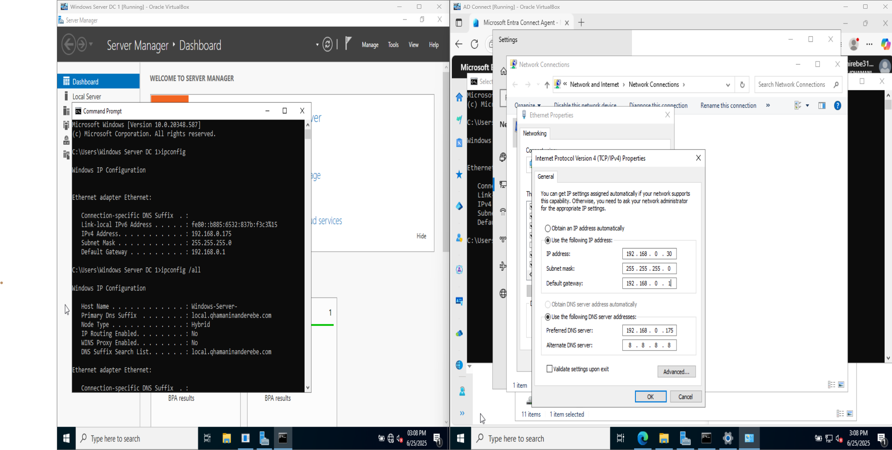
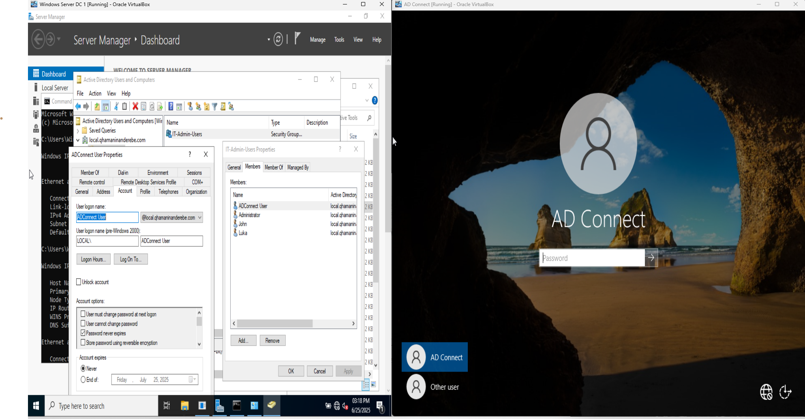
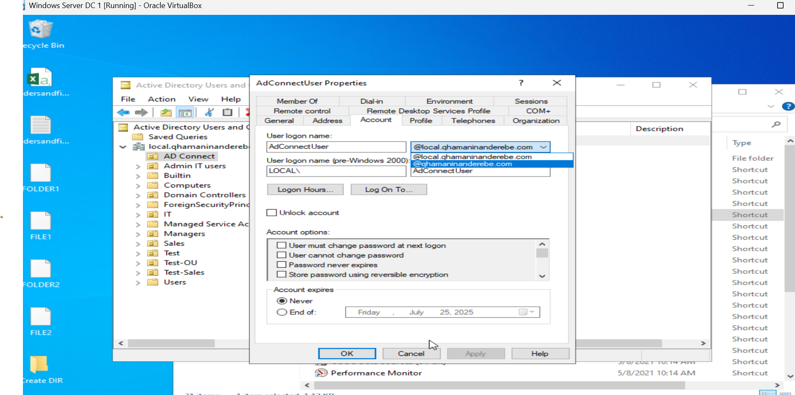
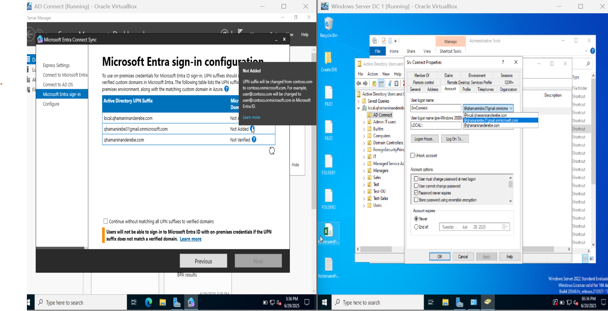
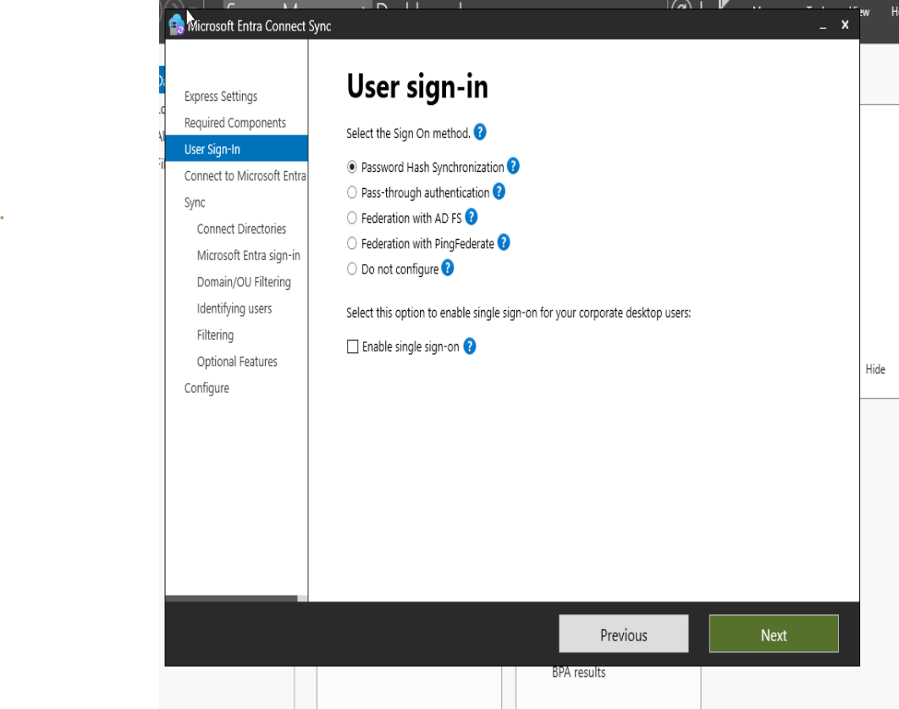
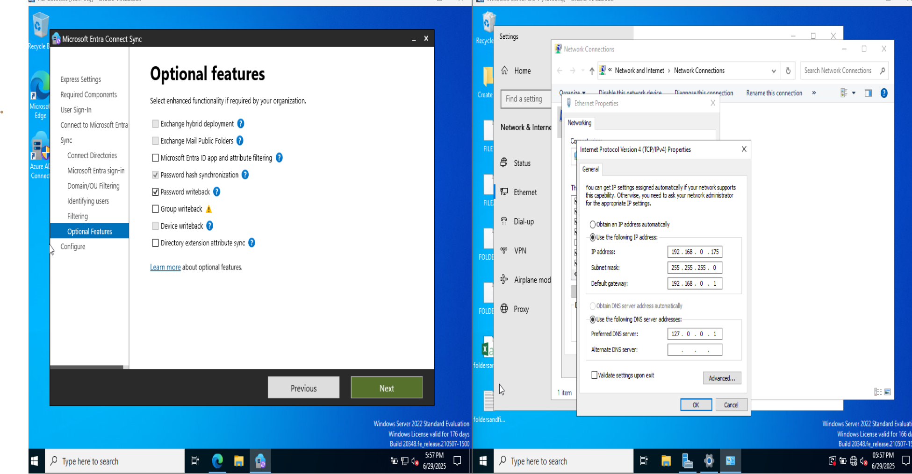
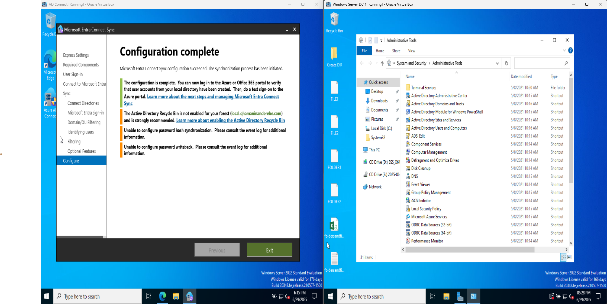

# AD-Connect-Sync-Lab

# 🔄 Azure AD Connect Sync Lab

This lab was designed to simulate a **Hybrid Identity environment** by syncing on-prem Active Directory users and passwords to Azure AD using **Azure AD Connect**.

Although full synchronization didn’t complete due to domain verification issues, this lab demonstrates critical setup steps and helps identify where cloud readiness and DNS configuration come into play.

---

## 💡 Lab Objectives

- Simulate a hybrid setup using VirtualBox
- Sync on-prem users and passwords to Azure AD
- Match UPN suffixes for seamless authentication
- Understand DNS, Password Hash Sync, and Writeback options
- Learn from failed sync due to missing custom domain verification

---

## 🖥️ Lab Steps & Screenshots

| Step | Description | Screenshot |
|------|-------------|------------|
| 1 | Setup custom DNS (DC IP + 8.8.8.8) for domain join and internet |  |
| 2 | Join the server to the local domain |  |
| 3 | Modify user UPN to match Azure domain |  |
| 4 | Install and configure Azure AD Connect |  |
| 5 | Enabled Password Hash Synchronization |  |
| 6 | Enabled Password Writeback |  |
| 7 | Completed AD Connect config |  |

---

## 🚧 Challenges Faced

- ⚠️ Sync didn’t complete due to missing **custom domain verification** in Azure AD.
- A public/rented domain is required for seamless federation and synchronization.

---

## ✅ Key Learnings

- AD Connect is a powerful tool to bridge identity between on-prem and cloud.
- Proper DNS and UPN alignment is critical for successful sync.
- Even failed attempts offer valuable insights into how hybrid identity works.

---

## 📌 Next Steps

I will explore domain verification with a public DNS zone and retry the sync in the future. Stay tuned for updates!

---

## 📸 Screenshots

All screenshots of the full process are in the `/screenshots` folder.

---

## 🧠 Author Note

This lab taught me that understanding identity sync involves **more than just installation—it’s architecture, DNS, and policy alignment**. I’ll continue to solidify this skill as I advance toward enterprise-ready hybrid cloud scenarios.

---

